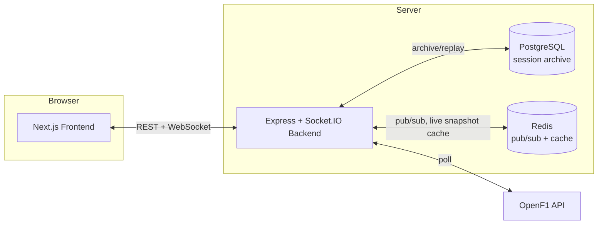

# APEX F1 // Live Telemetry, Track Tracker & Overtake Predictor

A live Formula 1 dashboard: real-time car positions and telemetry, full session replay, tyre strategy timelines, race control feed, and an overtake predictor that reasons from real gap trends and lap-time pace instead of just proximity. Built on the free [OpenF1 API](https://openf1.org/), with Postgres archival so completed sessions replay instantly without re-fetching.

**Live demo:** [f1-live-telemetry.vercel.app](https://f1-live-telemetry.vercel.app/) · **Backend:** [f1-live-telemetry.onrender.com](https://f1-live-telemetry.onrender.com)

## Features

- **Live telemetry** — real-time car positions on a traced circuit map, speed/gear/throttle/brake, updated via WebSocket.
- **Session replay** — scrub, play, and change speed (1x/2x/4x) through any completed session, backed by a one-time Postgres archival job so replays don't re-hit the OpenF1 API.
- **Per-tab independence** — two browser tabs (or two viewers) can watch two different sessions, or the same session at two different scrub positions, without affecting each other.
- **Overtake predictor** — ranks live battles by a probability model that blends gap trend (regression over the recent gap history, not just a two-point diff), real lap-time pace delta, tyre/compound age, DRS/Manual-Override state (era-aware: full telemetry-confirmed weight pre-2026, reduced weight for 2026+ where it isn't reported), and speed delta. Only battles with a genuine >70% chance are shown, each with an estimated laps-*and*-seconds-to-pass.
- **Race control feed** — flags, safety car/VSC, and penalties, with the circuit map's track color reacting live.
- **Tyre strategy timeline** — full-race stint history and pit stops for the whole grid.
- **Driver comparison** — side-by-side live telemetry and lap-time charts for up to 3 drivers.
- **Match Explorer** — browse and load any race weekend back to 2023.
- **Mobile-responsive**, dark-themed UI.

## Architecture



- **Live session**: the backend polls OpenF1 on a shared budget-aware loop and broadcasts one snapshot to every connected viewer over a Socket.IO room.
- **Completed session**: a one-time ingestion job archives the full session into Postgres; every subsequent viewer (and every scrub) reads from the archive, not OpenF1, and each viewer gets an independent, stateless replay position.
- **Redis** is pub/sub for the live snapshot fan-out and a cache for the last known snapshot — both degrade gracefully to an in-process fallback if Redis is unreachable, so the app still runs without it (Docker Compose just gives you a real one locally).

## Tech stack

| Layer | Stack |
|---|---|
| Frontend | Next.js 14 (App Router), React 18, TypeScript, Tailwind CSS, Socket.IO client |
| Backend | Node.js, Express, Socket.IO, TypeScript, Zod |
| Data | PostgreSQL via Prisma, Redis (ioredis) |
| Data source | [OpenF1 API](https://openf1.org/) (free, public) |
| Deployment | Vercel (frontend), Render (backend) |

## Quick start (Docker — recommended)

Runs the whole stack — Postgres, Redis, backend, frontend — with one command and no external services or accounts.

**Prerequisites:** [Docker](https://docs.docker.com/get-docker/) with Compose v2.

```bash
git clone https://github.com/onkarsabale15/f1-live-telemetry.git
cd f1-live-telemetry
docker compose up --build
```

Then open **http://localhost:3000**. The backend comes up at **http://localhost:4000** (health check: `/api/health`).

The first run downloads base images and installs dependencies, so it needs internet access; the app itself also needs internet at runtime to reach the public OpenF1 API (that's unavoidable — it's the actual data source). Postgres and Redis are fully local, with no accounts or external services required.

Useful commands:

```bash
docker compose up --build -d   # run in the background
docker compose logs -f backend # tail one service's logs
docker compose down            # stop everything
docker compose down -v         # stop and also wipe the local Postgres volume
```

Sign-in ("Continue with Google") is a mocked demo flow in this project — it doesn't call real Google OAuth, so no Google credentials are needed to run or use the app.

## Quick start (manual, no Docker)

**Prerequisites:** Node.js 20+. Postgres and Redis are optional — the app runs without them (session archival/replay and cross-instance pub/sub are disabled, live viewing still works).

```bash
git clone https://github.com/onkarsabale15/f1-live-telemetry.git
cd f1-live-telemetry

cp .env.example .env
# edit .env: DATABASE_URL / REDIS_URL if you have a local Postgres/Redis,
# or leave them out entirely to run without archival/replay.

npm run build:backend
npm run build:frontend

npm run start:backend   # terminal 1 — http://localhost:4000
npm run start:frontend  # terminal 2 — http://localhost:3000
```

For active development, run each side's own dev server instead of the built output:

```bash
cd backend && npm install && npm run dev    # ts-node-dev, auto-restarts on change
cd frontend && npm install && npm run dev   # next dev, hot reload
```

If you have a local Postgres, push the schema once (there's no migration history — this project uses `prisma db push`):

```bash
cd backend && npm run prisma:push
```

## Environment variables

| Variable | Required | Default | Description |
|---|---|---|---|
| `DATABASE_URL` | No | — | Postgres connection string. Omit to run without session archival/replay. |
| `REDIS_URL` | No | `redis://localhost:6379` | Redis connection string. Omit to fall back to an in-process pub/sub (single instance only). |
| `PORT` | No | `4000` | Backend HTTP/WebSocket port. |
| `NODE_ENV` | No | `development` | `development` \| `production` \| `test`. |
| `CORS_ORIGIN` | No | `http://localhost:3000` | Origin allowed to call the backend's REST API. Must exactly match the frontend's deployed origin in production. |
| `FRONTEND_URL` | No | `http://localhost:3000` | Used for links back to the frontend. |
| `JWT_SECRET` | No | dev default | Signing secret — set a real value in production. |
| `OPENF1_API_KEY` | No | — | OpenF1 works without a key on the free tier; only needed if you have one. |
| `NEXT_PUBLIC_BACKEND_URL` | No | `http://localhost:4000` | Frontend → backend URL. **Baked in at build time** (Next.js `NEXT_PUBLIC_*` rule) — rebuild the frontend after changing it. |
| `NEXTAUTH_URL` / `NEXTAUTH_SECRET` | No | dev defaults | Required by NextAuth's internals even though "Continue with Google" is a mocked demo flow here, not real OAuth. |
| `GOOGLE_CLIENT_ID` / `GOOGLE_CLIENT_SECRET` | No | — | Unused by the current mocked sign-in flow; only needed if you wire up real Google OAuth. |

See [.env.example](.env.example) for a ready-to-copy template. Docker Compose sets all of these itself — no `.env` file needed for the Docker path.

## Project structure

```
.
├── backend/                 Express + Socket.IO API and live-data engine
│   ├── src/
│   │   ├── config/          Env validation (Zod)
│   │   ├── controllers/     REST route handlers
│   │   ├── db/              Prisma + Redis clients (both fail gracefully)
│   │   ├── domain/          Pure math/formulas + shared types
│   │   ├── services/        OpenF1 polling, ingestion, replay, prediction
│   │   └── websocket/       Socket.IO gateway + per-socket replay state
│   ├── prisma/schema.prisma
│   └── tests/
├── frontend/                 Next.js App Router UI
│   └── src/
│       ├── app/              Routes/layout
│       ├── components/       One folder per feature area (circuit, battles, telemetry, ...)
│       ├── hooks/             Socket connection + data hooks
│       ├── types/             Shared frontend types (mirrors backend/src/domain/models.ts)
│       └── utils/
├── tests/e2e/                Cross-stack Playwright/fetch test suite (5 tiers)
├── docker-compose.yml
├── backend/Dockerfile
└── frontend/Dockerfile
```

## Scripts

| Command (from repo root) | Does |
|---|---|
| `npm run build` | Build backend then frontend (installs each side's own deps first — see [CONTRIBUTING.md](CONTRIBUTING.md) for why). |
| `npm run start` / `npm run start:backend` | Start the built backend. |
| `npm run start:frontend` | Start the built frontend. |
| `npm test` / `npm run test:e2e` | Run the full e2e suite (tiers 1–5) — see [Testing](#testing). |
| `npm run test:tier1` … `test:tier5` | Run one tier only. |

## Testing

```bash
npm test
```

The suite in `tests/e2e/` auto-detects a backend already running at `http://localhost:4000` (e.g. from `docker compose up` or `npm run dev`) and uses it; if none is found, it spins up an in-process instance itself. Tiers:

1. **Feature** — core API/behavior correctness
2. **Boundary** — edge cases and input validation
3. **Interactions** — multi-step flows
4. **Scenarios** — realistic end-to-end sequences
5. **Adversarial** (backend + frontend) — malformed input, rate limits, concurrency

Backend-only unit checks: `cd backend && npx ts-node tests/security.test.ts`.

## Deployment

- **Frontend** deploys to [Vercel](https://vercel.com/) from `frontend/`.
- **Backend** deploys to [Render](https://render.com/) from `backend/`, build command `npm run build:backend` (root), start command `npm run start:backend` (root) — see root `package.json` for the exact scripts, which install each workspace's own dependencies and generate the Prisma client since this isn't an npm workspaces monorepo.
- Render's `CORS_ORIGIN` env var must exactly match the deployed frontend's origin, or the browser blocks REST calls (WebSocket isn't affected the same way, which is why "the socket connects but the API doesn't" is a CORS symptom, not a connectivity one).

## Contributing

See [CONTRIBUTING.md](CONTRIBUTING.md).

## License

[MIT](LICENSE)
